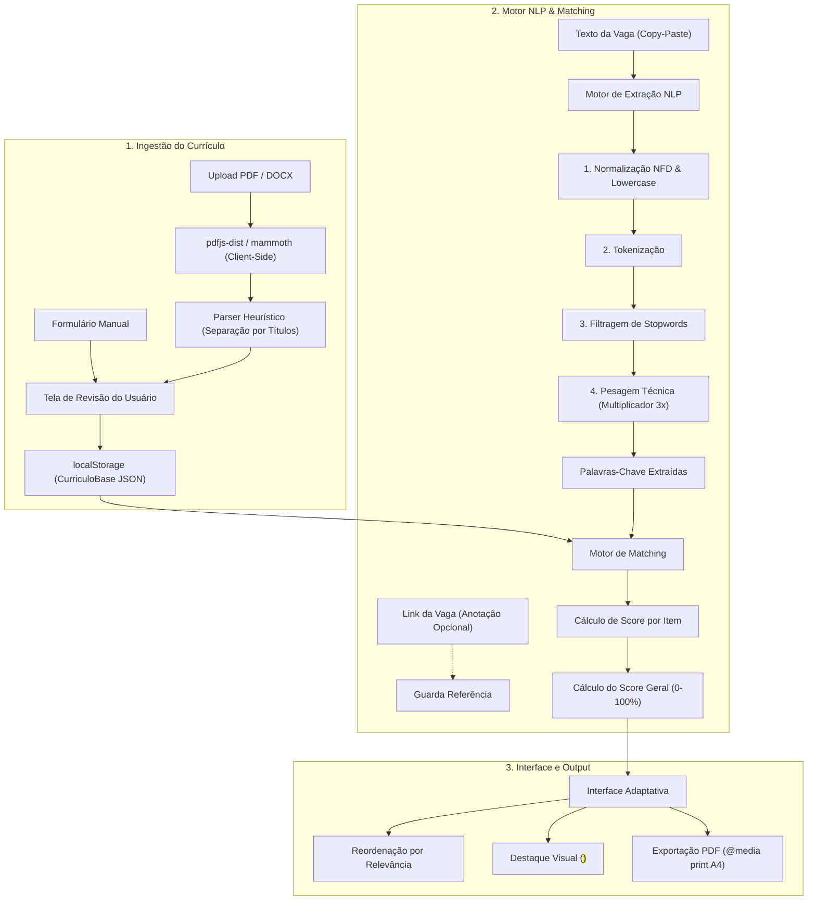

# 📄 Currículo Adaptativo

[](https://react.dev/)
[](https://www.typescriptlang.org/)
[](https://vitejs.dev/)
[](https://tailwindcss.com/)
[](https://vitest.dev/)
[](LICENSE)

> Aplicação web 100% client-side que analisa descrições de vagas de tecnologia, extrai termos técnicos e reordena/destaca automaticamente as seções do currículo estruturado com base em um algoritmo determinístico de NLP (Natural Language Processing). Inclui importação automática de arquivos PDF/DOCX 100% no navegador.

---

## 📌 Sumário

- [1. Visão Geral](#1-visão-geral)
  - [1.1 O Problema Real](#11-o-problema-real)
  - [1.2 A Solução Proposta](#12-a-solução-proposta)
  - [1.3 Diferencial de Portfólio](#13-diferencial-de-portfólio)
  - [1.4 Escopo Fora do MVP (Roadmap Futuro)](#14-escopo-fora-do-mvp-roadmap-futuro)
- [2. Decisões de Arquitetura (ADRs)](#2-decisões-de-arquitetura-adrs)
  - [ADR-01: Aplicação 100% Client-Side e NLP Determinístico](#adr-01-aplicação-100-client-side-e-nlp-determinístico)
  - [ADR-02: Link da Vaga é Anotação, Não Fonte de Dados Automática](#adr-02-link-da-vaga-é-anotação-não-fonte-de-dados-automática)
- [3. Arquitetura e Fluxo de Dados](#3-arquitetura-e-fluxo-de-dados)
- [4. Modelo de Dados](#4-modelo-de-dados)
- [5. Motores de Processamento](#5-motores-de-processamento)
  - [5.1 Ingestão e Parser de Arquivos (`importacao-arquivo.ts` / `parser-heuristico.ts`)](#51-ingestão-e-parser-de-arquivos-importacao-arquivots--parser-heuristicots)
  - [5.2 Motor de Extração de Termos (`motor-extracao.ts`)](#52-motor-de-extração-de-termos-motor-extracaots)
  - [5.3 Motor de Matching e Scoring (`motor-matching.ts`)](#53-motor-de-matching-e-scoring-motor-matchingts)
- [6. Roadmap de Desenvolvimento (Sprints)](#6-roadmap-de-desenvolvimento-sprints)
- [7. Como Rodar o Projeto](#7-como-rodar-o-projeto)
- [8. Licença](#8-licença)

---

## 1. Visão Geral

### 1.1 O Problema Real
Candidatos a vagas de desenvolvimento mantêm múltiplas versões de currículo (Front-End, Back-End, DevOps, Full Stack). A cada candidatura, escolher e ajustar manualmente a versão certa é um processo lento, inconsistente e ineficiente.

### 1.2 A Solução Proposta
O **Currículo Adaptativo** permite cadastrar **uma única base estruturada de currículo**, de duas formas flexíveis:
1. **Cadastro Manual:** Formulário direto com campos organizados.
2. **Importação Inteligente (PDF ou DOCX):** Extração de texto 100% no navegador e segmentação por heurística com etapa de revisão pelo usuário.

Ao colar a descrição de uma vaga desejada (e opcionalmente guardar o link da vaga como anotação), o sistema:
1. **Extrai** palavras-chave técnicas e requisitos.
2. **Calcula o score de relevância** de cada item (experiência, projeto, habilidade) em relação à vaga.
3. **Reordena as seções** por relevância e aplica **destaque visual** nos termos correspondentes.
4. **Gera uma versão exportável em PDF** (otimizada para A4 / impressão) sem elementos visuais da interface.

### 1.3 Diferencial de Portfólio
- **Foco em Algoritmo e Engenharia:** Não depende de chamadas a APIs de IA de terceiros. O algoritmo de matching é construído com técnicas auditáveis de NLP clássico.
- **Arquitetura Client-Side-First:** Sem backend, sem banco de dados remoto e sem custo de infraestrutura. Roda 100% no navegador com persistência em `localStorage`.
- **Privacidade por Design:** Seus dados profissionais e pessoais permanecem 100% no seu dispositivo.

### 1.4 Escopo Fora do MVP (Roadmap Futuro)
- Sugestão de reescrita de bullet points via LLM.
- Suporte a múltiplos idiomas.
- Fetch automático de vagas via URL (exige serverless function devido a bloqueios de CORS — ver ADR-02).
- Compartilhamento de currículos entre usuários.

---

## 2. Decisões de Arquitetura (ADRs)

### ADR-01: Aplicação 100% Client-Side e NLP Determinístico
- **Decisão:** Processar dados, importar arquivos (PDF/DOCX) e calcular o matching totalmente no navegador via `localStorage`, `pdfjs-dist`, `mammoth` e regras determinísticas de NLP (tokenização + remoção de stopwords + pesagem por dicionário técnico).
- **Por quê:** Elimina custos recorrentes de APIs/servidores, previne latência e garante privacidade total dos dados sensíveis do usuário.
- **Trade-off:** O matching não interpreta sinônimos semânticos complexos como uma LLM, mas é instantâneo, auditável, gratuito e previsível.

### ADR-02: Link da Vaga é Anotação, Não Fonte de Dados Automática
- **Decisão:** No MVP, o campo de link da vaga é tratado estritamente como anotação opcional associada ao resultado do matching. O texto da vaga é inserido manualmente via *copy-paste*.
- **Por quê:** Aplicações client-side que tentam buscar URLs externas no navegador esbarram em políticas de **CORS** (Cross-Origin Resource Sharing) impostas pelos portais de vaga (LinkedIn, Gupy, etc.) e na fragilidade da oscilação de layouts HTML.
- **Trade-off:** Exige um passo de copiar e colar o texto da vaga, mantendo a arquitetura simples e livre de servidores.
- **Evolução Futura:** Criação de uma Vercel Serverless Function dedicada exclusivamente ao web scraping e proxy de busca.

---

## 3. Arquitetura e Fluxo de Dados



---

## 4. Modelo de Dados

Tipagem em TypeScript (`tipos.ts` e `resultado-matching.ts`):

```typescript
export interface ItemExperiencia {
  id: string;
  cargo: string;
  empresa: string;
  periodo: string; // ex: "Jan 2024 - Ago 2024"
  descricao: string;
  tecnologias: string[]; // ex: ["React", "TypeScript", "Node.js"]
}

export interface ItemProjeto {
  id: string;
  nome: string;
  descricao: string;
  tecnologias: string[];
  link?: string;
}

export interface Habilidade {
  nome: string;
  categoria: "linguagem" | "framework" | "banco-de-dados" | "ferramenta" | "outro";
}

export interface Formacao {
  curso: string;
  instituicao: string;
  periodo: string;
}

export interface CurriculoBase {
  dadosPessoais: {
    nome: string;
    email: string;
    telefone?: string;
    linkedin?: string;
    github?: string;
  };
  resumoProfissional: string;
  experiencias: ItemExperiencia[];
  projetos: ItemProjeto[];
  habilidades: Habilidade[];
  formacao: Formacao[];
}

export interface PalavraChaveExtraida {
  termo: string;
  peso: number;
}

export interface ScoreItem {
  id: string;
  score: number;
  termosCasados: string[];
}

export interface ResultadoMatching {
  palavrasChaveDaVaga: PalavraChaveExtraida[];
  scoresExperiencias: ScoreItem[];
  scoresProjetos: ScoreItem[];
  scoresHabilidades: ScoreItem[];
  scoreGeral: number; // 0-100%
  linkVaga?: string; // Anotação opcional (ADR-02)
}
```

---

## 5. Motores de Processamento

### 5.1 Ingestão e Parser de Arquivos (`importacao-arquivo.ts` / `parser-heuristico.ts`)
Converte currículos em PDF ou DOCX em texto estruturado sem enviar arquivos para servidores externos:
- **PDF (`pdfjs-dist`):** Itera pelas páginas do PDF e concatena os blocos de texto nativos.
- **DOCX (`mammoth`):** Converte a estrutura XML do Word em texto puro.
- **Parser Heurístico:** Detecta títulos comuns de seções através de Regex (`/experi[êe]ncia/i`, `/projetos?/i`, `/habilidades/i`, `/forma[çc][ãa]o/i`) e divide o texto em blocos para pré-preencher a tela de revisão.

### 5.2 Motor de Extração de Termos (`motor-extracao.ts`)
1. **Normalização:** Remove acentuação e transforma em minúsculas (`normalize("NFD")`).
2. **Tokenização:** Divide palavras descartando pontuações e numerais isolados.
3. **Filtragem:** Descarta *stopwords* comuns da língua portuguesa (`de`, `para`, `com`, `experiência`).
4. **Pesagem por Dicionário Técnico:** Eleva o peso de tecnologias reconhecidas (ex: `React`, `Docker`, `Java`, `PostgreSQL`) com multiplicador 3x sobre a frequência bruta.

### 5.3 Motor de Matching e Scoring (`motor-matching.ts`)
1. Mapeia os termos da vaga contra cada item do currículo base.
2. Calcula pontuações individuais acumulando pesos dos termos casados.
3. Normaliza o resultado no **Score Geral (0-100%)** com base no total máximo teoricamente possível.

---

## 6. Roadmap de Desenvolvimento (Sprints)

| Sprint | Entrega Principal | Status |
| :---: | :--- | :---: |
| **Sprint 1** | Setup do Projeto + Modelo de Dados + Persistência Local (`useCurriculo`) + Importação Client-Side de PDF/DOCX | ✅ Concluído |
| **Sprint 2** | Motor de Extração de Termos da Vaga (`motor-extracao.ts`) + Anotação de Link da Vaga (ADR-02) | ⏳ Planejado |
| **Sprint 3** | Algoritmo de Matching e Cálculo de Scores (`motor-matching.ts`) | ⏳ Planejado |
| **Sprint 4** | Reordenação dinâmica e destaque visual de termos na UI | ⏳ Planejado |
| **Sprint 5** | Tela de comparação entre múltiplas vagas simultâneas | ⏳ Planejado |
| **Sprint 6** | Exportação otimizada para PDF via `@media print` | ⏳ Planejado |
| **Sprint 7** | Suíte de testes automatizados com Vitest (Motores NLP & Matching) | ⏳ Planejado |
| **Sprint 8** | Deploy na Vercel, documentação e publicação de resultados | ⏳ Planejado |

---

## 7. Como Rodar o Projeto

### Pré-requisitos
- **Node.js**: `^18.0.0` ou superior
- **npm** ou **pnpm** / **yarn**

### Passo a Passo

1. **Clonar o repositório:**
   ```bash
   git clone https://github.com/seu-usuario/app-curriculo-adaptativo.git
   cd app-curriculo-adaptativo
   ```

2. **Instalar as dependências:**
   ```bash
   npm install
   ```

3. **Executar o ambiente de desenvolvimento:**
   ```bash
   npm run dev
   ```

4. **Executar a suíte de testes:**
   ```bash
   npm run test
   ```

5. **Gerar a build de produção:**
   ```bash
   npm run build
   ```

---

## 8. Licença

Este projeto está sob a licença [MIT](LICENSE).
